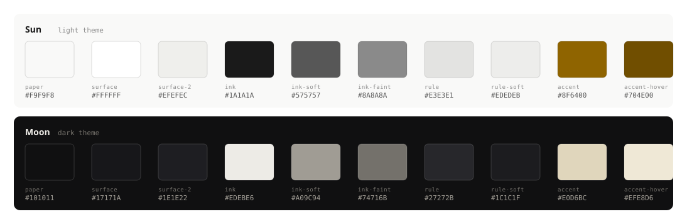

# janaskar.github.io

Personal site — one static page, no build step.

- `index.html` — the whole site: markup, styles and the small script that
  drives the theme toggle and the click-to-load video players.
- `logo.svg` — wordmark, inverted and blended into the fixed header.
- `palette.svg` — the swatch chart below, regenerated by hand when the
  palette changes.
- `CV-Jay-Janaskar.pdf` — built from the `cv` repo, copied in on update.
- `.nojekyll` — serve the files as-is, no Jekyll processing.

## Palette

Deploy: push to `main`. GitHub Pages serves the repository root.

The DribbleAMP videos are embedded click-to-load, so nothing from YouTube
loads until a thumbnail is clicked. They need a real HTTP origin — opening
`index.html` straight off disk gives YouTube error 153. To preview locally:

    python3 -m http.server 8080

then visit http://localhost:8080.
